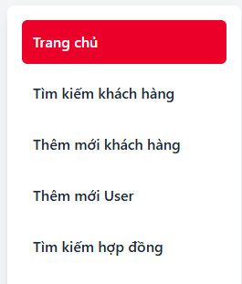

# 🏢 CRM System - Customer Relationship Management Platform


*Modern, responsive CRM interface with Vietnamese language support*

A comprehensive, enterprise-grade Customer Relationship Management system built with Spring Boot, featuring role-based access control, contract management, and advanced reporting capabilities.

## 🌟 Overview

This CRM system is designed to streamline customer relationship management processes, providing a centralized platform for managing clients, contracts, and business operations. The system features a modern, responsive web interface with Vietnamese language support and follows enterprise security standards.

## ✨ Key Features

### 👥 **Client Management**

*Comprehensive client profile management with project tracking and assignment capabilities*

- **Complete Client Profiles**: Store comprehensive client information including contact details, project specifications, and business relationships
- **Project Tracking**: Monitor project budgets, timelines, and progress
- **Client Categorization**: Organize clients by industry, opportunity level, and source
- **Assignment Management**: Assign clients to specific team members for personalized service

### 📋 **Contract Management**

*Full contract lifecycle management with progress tracking and value monitoring*

- **Contract Lifecycle Management**: Handle contracts from initial proposal to completion
- **Contract Types**: Support for different contract categories (In-Progress, Done Deal)
- **Progress Tracking**: Monitor contract status, milestones, and deliverables
- **Value Management**: Track expected and actual contract values

### 🔐 **Role-Based Access Control**
<!-- 
*Different interface views and permissions based on user roles* -->

- **Multi-Level Security**: Implemented with Spring Security
- **Role Hierarchy**: 
  - **ADMIN**: Full system access, user management, system configuration
  - **EMPLOYEE**: Client management, contract creation, data entry

### 📊 **Advanced Reporting & Analytics**
- **Excel Export**: Export client and contract data to Excel format
- **CSV Import/Export**: Bulk data operations for efficient data management
- **Custom Reports**: Generate reports based on various criteria
- **Dashboard Analytics**: Real-time insights into business performance

### 🔍 **Search & Filtering**
- **Advanced Search**: Multi-criteria search across clients and contracts
- **Role-Specific Views**: Different search interfaces based on user permissions
- **Filter Options**: Filter by status, category, date ranges, and more
- **Quick Access**: Fast navigation to frequently used data

## 🛠️ Technology Stack

### **Backend**
- **Spring Boot 1.5.10**: Core application framework
- **Spring Security**: Authentication and authorization
- **Spring Data JPA**: Data persistence layer
- **Hibernate**: ORM for database operations
- **MySQL**: Primary database
- **Maven**: Dependency management and build tool

### **Frontend**
- **Thymeleaf**: Server-side templating engine
- **Tailwind CSS**: Modern, responsive styling
- **JavaScript**: Interactive client-side functionality
- **Font Awesome**: Icon library
- **Google Fonts**: Typography (Open Sans)

### **Additional Libraries**
- **Swagger/OpenAPI**: API documentation
- **Lombok**: Code generation and simplification
- **OpenCSV**: CSV file processing
- **Apache POI**: Excel file operations
- **iText7**: PDF generation capabilities

## 🚀 Getting Started

### Prerequisites
- **Java 8** or higher
- **Maven 3.6+**
- **MySQL 5.7+** or **MySQL 8.0+**

### Installation

1. **Clone the Repository**
   ```bash
   git clone <repository-url>
   cd crm
   ```

2. **Database Setup**
   - Create a MySQL database
   - Update database configuration in `src/main/resources/application.properties`:
   ```properties
   spring.datasource.url=jdbc:mysql://localhost:3306/your_database_name?useSSL=false&serverTimezone=UTC
   spring.datasource.username=your_username
   spring.datasource.password=your_password
   ```

3. **Build and Run**
   ```bash
   mvn clean compile
   mvn spring-boot:run
   ```

4. **Access the Application**
   - Open your browser and navigate to `http://localhost:8080`
   - The application will automatically create necessary database tables

## 📱 User Interface

### **Landing Page**

*Secure authentication with modern modal design and Vietnamese language support*

- Modern, responsive design with Vietnamese language support
- Feature highlights and system overview
- Secure login modal with authentication

### **Dashboard**

*Personalized home page with role-based content and real-time data overview*

- Personalized home page based on user role
- Quick access to assigned clients and contracts
- Real-time data overview and statistics

## 🔒 Security Features

### **Authentication**
- Secure login with email/password
- Password encryption using BCrypt
- Session management and timeout handling

### **Authorization**
- Role-based access control (RBAC)
- Endpoint-level security
- Data access restrictions based on user roles

### **Data Protection**
- Input validation and sanitization
- SQL injection prevention
- XSS protection
- CSRF protection

## 📋 API Documentation

The system includes comprehensive API documentation accessible via Swagger UI:

- **Swagger UI**: `http://localhost:8080/swagger-ui.html`
- **API Endpoints**: RESTful APIs for all major operations
- **Authentication**: Secure API access with proper authentication

## 🗂️ Data Models

### **Core Entities**

#### **User**
- User authentication and profile information
- Role assignment and permissions
- Supervisor relationships for hierarchical management

#### **Client**
- Complete client information
- Project details and budgets
- Contact information and business relationships
- Assignment to team members

#### **Contract**
- Contract lifecycle management
- Value tracking and progress monitoring
- Client associations and team assignments

#### **Role**
- Flexible role definition system
- Permission-based access control
- Hierarchical role structure

## 🔧 Configuration

### **Application Properties**
```properties
# Server Configuration
server.port=8080

# Database Configuration
spring.datasource.url=jdbc:mysql://localhost:3306/your_database_name?useSSL=false&serverTimezone=UTC
spring.datasource.username=your_database_username
spring.datasource.password=your_database_password

# JPA/Hibernate Configuration
spring.jpa.hibernate.ddl-auto=update
spring.jpa.show-sql=true

# Security Configuration
logging.level.org.springframework.security=DEBUG
```

### **Environment Variables**
- Database connection details
- Security keys and tokens
- External service configurations

## 📊 Features by Role

### **ADMIN**

*Full system access with user management and system configuration capabilities*

- ✅ Full system access
- ✅ User management and role assignment
- ✅ System configuration and maintenance
- ✅ Data export and import capabilities
- ✅ All contract and client operations

### **EMPLOYEE**

*Focused interface for client management and data entry tasks*

- ✅ Client management and data entry
- ✅ Contract creation and updates
- ✅ Personal dashboard and assigned tasks
- ✅ Basic reporting capabilities

## 🚀 Deployment

### **Production Deployment**
1. Configure production database
2. Update application properties for production environment
3. Build the application: `mvn clean package`
4. Deploy the generated JAR file
5. Configure reverse proxy (nginx/Apache) if needed

### **Docker Support**
The application includes Dockerfile for containerized deployment:
```bash
docker build -t crm-system .
docker run -p 8080:8080 crm-system
```

## 🤝 Contributing

1. Fork the repository
2. Create a feature branch (`git checkout -b feature/amazing-feature`)
3. Commit your changes (`git commit -m 'Add some amazing feature'`)
4. Push to the branch (`git push origin feature/amazing-feature`)
5. Open a Pull Request

## 📝 License

This project is licensed under the MIT License - see the [LICENSE.txt](LICENSE.txt) file for details.

## 🆘 Support

For support and questions:
- Create an issue in the repository
- Contact the development team
- Check the API documentation for technical details

## 🔮 Future Enhancements

- **Mobile Application**: Native mobile app for field operations
- **Advanced Analytics**: Machine learning insights and predictions
- **Integration APIs**: Third-party system integrations
- **Multi-language Support**: Additional language options
- **Real-time Notifications**: Push notifications and alerts
- **Document Management**: File upload and management system

---

**Built with ❤️ using Spring Boot and modern web technologies**

*This CRM system represents a comprehensive solution for managing customer relationships, contracts, and business operations with enterprise-grade security and scalability.*
